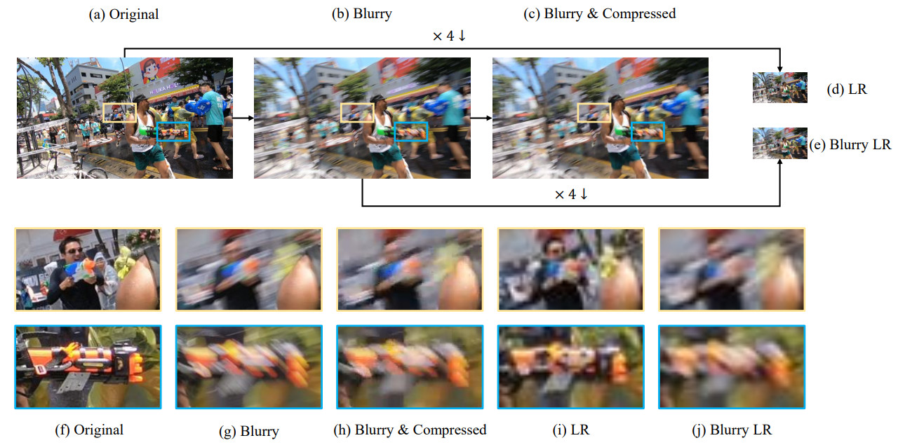
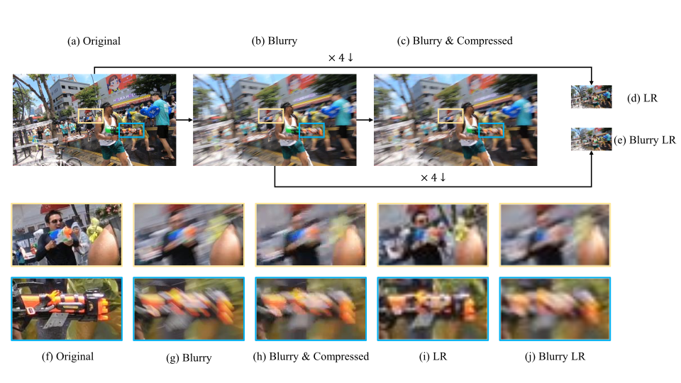

# [Publications](../publications) | [Datasets](datasets) | [CV](../cv.pdf)
___

## <font color="red">REDS</font> dataset

<!--  -->


We provide the **<font color="red">RE</font>**alistic and **<font color="red">D</font>**ynamic **<font color="red">S</font>**cenes dataset for video deblurring and super-resolution. Train and validation subsets are publicly available.
The dataset can be downloaded by running the python code or clicking the links below.
Downloads are available via Google Drive and SNU CVLab server.

[download_REDS.py](https://gist.github.com/SeungjunNah/b10d369b92840cb8dd2118dd4f41d643)

### <font color="FireBrick">Google Drive</font>

Type | Train | Validation | Test
-- | -- | -- | --
Sharp | [train_sharp](https://drive.google.com/open?id=1YLksKtMhd2mWyVSkvhDaDLWSc1qYNCz-) | [val_sharp](https://drive.google.com/open?id=1MGeObVQ1-Z29f-myDP7-8c3u0_xECKXq) | test_sharp
Blur | [train_blur](https://drive.google.com/open?id=1Be2cgzuuXibcqAuJekDgvHq4MLYkCgR8) | [val_blur](https://drive.google.com/open?id=1N8z2yD0GDWmh6U4d4EADERtcUgDzGrHx) | [test_blur](https://drive.google.com/file/d/1dr0--ZBKqr4P1M8lek6JKD1Vd6bhhrZT/view?usp=sharing)
Blur + Compression | [train_blur_comp](https://drive.google.com/open?id=1hi6348BB9QQFqVx2PY7pKn32HQM89CJ1) | [val_blur_comp](https://drive.google.com/open?id=13d1uzqLdbsQzeZkWgdF5QVHqDSjfE4zZ) | [test_blur_comp](https://drive.google.com/file/d/1OctyKR3ER_YWrZxKxQsZzLis3BvLSOFO/view?usp=sharing)
Low Resolution | [train_sharp_bicubic](https://drive.google.com/open?id=1a4PrjqT-hShvY9IyJm3sPF0ZaXyrCozR) | [val_sharp_bicubic](https://drive.google.com/open?id=1sChhtzN9Css10gX7Xsmc2JaC-2Pzco6a) | [test_sharp_bicubic](https://drive.google.com/file/d/1y0Jle6xB41TdRK_QMJ_E8W_iBMxwq_Rh/view?usp=sharing)
Blur + Low Resolution | [train_blur_bicubic](https://drive.google.com/open?id=10u8gthv2Q95RMCb1LeCN8N4ozB8TVjMt) | [val_blur_bicubic](https://drive.google.com/open?id=1i3NAb7EmF4fCYadGaHK54-Zgx9lIC2Gp) | [test_blur_bicubic](https://drive.google.com/file/d/14YszfzUAeAfwP0ZA2FRzAiVxxZLg7-tY/view?usp=sharing)

### <font color="FireBrick">SNU CVLab Server</font>

Type | Train | Validation | Test
-- | -- | -- | --
Sharp | [train_sharp](https://cv.snu.ac.kr/~snah/Deblur/dataset/REDS/train_sharp.zip) | [val_sharp](https://cv.snu.ac.kr/~snah/Deblur/dataset/REDS/val_sharp.zip) | test_sharp
Blur | [train_blur](https://cv.snu.ac.kr/~snah/Deblur/dataset/REDS/train_blur.zip) | [val_blur](https://cv.snu.ac.kr/~snah/Deblur/dataset/REDS/val_blur.zip) | [test_blur](https://cv.snu.ac.kr/~snah/Deblur/dataset/REDS/test_blur.zip)
Blur + Compression | [train_blur_comp](https://cv.snu.ac.kr/~snah/Deblur/dataset/REDS/train_blur_comp.zip) | [val_blur_comp](https://cv.snu.ac.kr/~snah/Deblur/dataset/REDS/val_blur_comp.zip) | [test_blur_comp](https://cv.snu.ac.kr/~snah/Deblur/dataset/REDS/test_blur_comp.zip)
Low Resolution | [train_sharp_bicubic](https://cv.snu.ac.kr/~snah/Deblur/dataset/REDS/train_sharp_bicubic.zip) | [val_sharp_bicubic](https://cv.snu.ac.kr/~snah/Deblur/dataset/REDS/val_sharp_bicubic.zip) | [test_sharp_bicubic](https://cv.snu.ac.kr/~snah/Deblur/dataset/REDS/test_sharp_bicubic.zip)
Blur + Low Resolution | [train_blur_bicubic](https://cv.snu.ac.kr/~snah/Deblur/dataset/REDS/train_blur_bicubic.zip) | [val_blur_bicubic](https://cv.snu.ac.kr/~snah/Deblur/dataset/REDS/val_blur_bicubic.zip) | [test_blur_bicubic](https://cv.snu.ac.kr/~snah/Deblur/dataset/REDS/test_blur_bicubic.zip)

## <font color="red">REDS</font> 120fps

REDS dataset is generated from 120 fps videos, synthesizing blurry frames by merging subsequent frames. The frames that are used to generate blurry images are available below for training and validation data. Due to the large file sizes, the dataset is divided into multiple zip files. Each zip file contains 15 sequences of length 500 that is equivalent to the time duration of the standard 24 fps version above. Each file size is around 10 GB.

Type | <font color="FireBrick">Google Drive</font> | <font color="FireBrick">SNU CVLab Server</font>
-- | -- | --
train_orig_part0.zip | [link](https://drive.google.com/file/d/1SbbGH3V5PbqfezDaWMMK4eeDCFUD54HS/view?usp=sharing) | [link](https://cv.snu.ac.kr/~snah/Deblur/dataset/REDS/orig/train_orig_part0.zip)
train_orig_part1.zip | [link](https://drive.google.com/file/d/14syvaC0IMB4NtPFvdop5dzqxllUKXTKS/view?usp=sharing) | [link](https://cv.snu.ac.kr/~snah/Deblur/dataset/REDS/orig/train_orig_part1.zip)
train_orig_part2.zip | [link](https://drive.google.com/file/d/11fluEfEBopcX-cGn5SFgwf_h8JfQGt7A/view?usp=sharing) | [link](https://cv.snu.ac.kr/~snah/Deblur/dataset/REDS/orig/train_orig_part2.zip)
train_orig_part3.zip | [link](https://drive.google.com/file/d/1R7QgDyPWU0dikl1st5XjDb308w-96baT/view?usp=sharing) | [link](https://cv.snu.ac.kr/~snah/Deblur/dataset/REDS/orig/train_orig_part3.zip)
train_orig_part4.zip | [link](https://drive.google.com/file/d/1coHJKOUxBkHQIAOmQcTNRrrp27WV0B9r/view?usp=sharing) | [link](https://cv.snu.ac.kr/~snah/Deblur/dataset/REDS/orig/train_orig_part4.zip)
train_orig_part5.zip | [link](https://drive.google.com/file/d/1vUpP0UYaqCQAiAYYS2z5_YEwZg6yXt6Y/view?usp=sharing) | [link](https://cv.snu.ac.kr/~snah/Deblur/dataset/REDS/orig/train_orig_part5.zip)
train_orig_part6.zip | [link](https://drive.google.com/file/d/1SIhKxGoTEo6NsmH9qR-XEqzppACdndKU/view?usp=sharing) | [link](https://cv.snu.ac.kr/~snah/Deblur/dataset/REDS/orig/train_orig_part6.zip)
train_orig_part7.zip | [link](https://drive.google.com/file/d/1ihKZf11vepVfJ4Apn_NOda1Ok5o6O0C0/view?usp=sharing) | [link](https://cv.snu.ac.kr/~snah/Deblur/dataset/REDS/orig/train_orig_part7.zip)
train_orig_part8.zip | [link](https://drive.google.com/file/d/1A0DT8xI0UerY4yFcyVnBJDtLm3u3NarG/view?usp=sharing) | [link](https://cv.snu.ac.kr/~snah/Deblur/dataset/REDS/orig/train_orig_part8.zip)
train_orig_part9.zip | [link](https://drive.google.com/file/d/1GjExuzbU7TEIpdP2aKqAKCCk2VlhdTPM/view?usp=sharing) | [link](https://cv.snu.ac.kr/~snah/Deblur/dataset/REDS/orig/train_orig_part9.zip)
train_orig_part10.zip | [link](https://drive.google.com/file/d/11vmraP75tis-8n8s53pvO5NtwDAKtfKl/view?usp=sharing) | [link](https://cv.snu.ac.kr/~snah/Deblur/dataset/REDS/orig/train_orig_part10.zip)
train_orig_part11.zip | [link](https://drive.google.com/file/d/1fvA9FBKXHrm5FL2IRofsVAITe5D4Fi_A/view?usp=sharing) | [link](https://cv.snu.ac.kr/~snah/Deblur/dataset/REDS/orig/train_orig_part11.zip)
train_orig_part12.zip | [link](https://drive.google.com/file/d/1MOkuFqbkj35H-fkP0PS3igAuE_LrAvTv/view?usp=sharing) | [link](https://cv.snu.ac.kr/~snah/Deblur/dataset/REDS/orig/train_orig_part12.zip)
train_orig_part13.zip | [link](https://drive.google.com/file/d/1Rnt0kmCnrnQtd-QYY1lPWpJz13jCLSXJ/view?usp=sharing) | [link](https://cv.snu.ac.kr/~snah/Deblur/dataset/REDS/orig/train_orig_part13.zip)
train_orig_part14.zip | [link](https://drive.google.com/file/d/1joFdd81DJujDfUMRdfCCAJMAK6rfFMIK/view?usp=sharing) | [link](https://cv.snu.ac.kr/~snah/Deblur/dataset/REDS/orig/train_orig_part14.zip)
train_orig_part15.zip | [link](https://drive.google.com/file/d/1izQaGBPZpBj5Pmr0a8whPX-RbAIOZi8x/view?usp=sharing) | [link](https://cv.snu.ac.kr/~snah/Deblur/dataset/REDS/orig/train_orig_part15.zip)
val_orig_part0.zip | [link](https://drive.google.com/file/d/1XqpCRaahvF1-mQMAeXfUxBNqqLFAGH59/view?usp=sharing) | [link](https://cv.snu.ac.kr/~snah/Deblur/dataset/REDS/orig/val_orig_part0.zip)
val_orig_part1.zip | [link](https://drive.google.com/file/d/1LJUDs7B63b7r4wek-C2d29gG1hfTOCYB/view?usp=sharing) | [link](https://cv.snu.ac.kr/~snah/Deblur/dataset/REDS/orig/val_orig_part1.zip)

## Updates

* Until the official submission site is published, we accept email submissions to seungjun.nah@gmail.com. The results will be replied back after being manually evaluated and will be posted on the leaderboard later.

* Due to the traffic limit of Google Drive, downloads are now available from SNU CVLab server, too.

* We are planning to host an open-end public leaderboard site for the **<font color="red">REDS</font>** related challenges.
We will provide evaluated PSNR and SSIM for the submitted test results.
Stay tuned for the updates!

## Reference

The **<font color="red">REDS</font>** dataset was used in the NTIRE 2019 and NTIRE 2020 Challenges. If you find our dataset useful for your research, please consider citing our work:

* **<font color="red">REDS</font>** dataset [[paper](http://openaccess.thecvf.com/content_CVPRW_2019/papers/NTIRE/Nah_NTIRE_2019_Challenge_on_Video_Deblurring_and_Super-Resolution_Dataset_and_CVPRW_2019_paper.pdf)] [[slides](https://drive.google.com/file/d/13F6UEyBDFGTiFDyxqLzrPiq4Y2-8BKQE/view?usp=sharing)] [[poster](https://drive.google.com/file/d/1rRd-6QoPqxJQCVIvxSXiaaxRIL4qGMsd/view?usp=sharing)]

```bibtex
@InProceedings{Nah_2019_CVPR_Workshops_REDS,
  author = {Nah, Seungjun and Baik, Sungyong and Hong, Seokil and Moon, Gyeongsik and Son, Sanghyun and Timofte, Radu and Lee, Kyoung Mu},
  title = {NTIRE 2019 Challenge on Video Deblurring and Super-Resolution: Dataset and Study},
  booktitle = {The IEEE Conference on Computer Vision and Pattern Recognition (CVPR) Workshops},
  month = {June},
  year = {2019}
}
```

* NTIRE 2019 Video Deblurring Challenge [[paper](http://openaccess.thecvf.com/content_CVPRW_2019/papers/NTIRE/Nah_NTIRE_2019_Challenge_on_Video_Deblurring_Methods_and_Results_CVPRW_2019_paper.pdf)]

```bibtex
@InProceedings{Nah_2019_CVPR_Workshops_Deblur,
  author = {Nah, Seungjun and Timofte, Radu and Baik, Sungyong and Hong, Seokil and Moon, Gyeongsik and Son, Sanghyun and Lee, Kyoung Mu},
  title = {NTIRE 2019 Challenge on Video Deblurring: Methods and Results},
  booktitle = {The IEEE Conference on Computer Vision and Pattern Recognition (CVPR) Workshops},
  month = {June},
  year = {2019}
}
```

* NTIRE 2019 Video Super-Resolution Challenge [[paper](http://openaccess.thecvf.com/content_CVPRW_2019/papers/NTIRE/Nah_NTIRE_2019_Challenge_on_Video_Super-Resolution_Methods_and_Results_CVPRW_2019_paper.pdf)]

```bibtex
@InProceedings{Nah_2019_CVPR_Workshops_SR,
	author = {Nah, Seungjun and Timofte, Radu and Gu, Shuhang and Baik, Sungyong and Hong, Seokil and Moon, Gyeongsik and Son, Sanghyun and Lee, Kyoung Mu},
	title = {NTIRE 2019 Challenge on Video Super-Resolution: Methods and Results},
	booktitle = {The IEEE Conference on Computer Vision and Pattern Recognition (CVPR) Workshops},
	month = {June},
	year = {2019}
}
```

* NTIRE 2020 Image and Video Deblurring Challenge [[paper](http://openaccess.thecvf.com/content_CVPRW_2020/papers/w31/Nah_NTIRE_2020_Challenge_on_Image_and_Video_Deblurring_CVPRW_2020_paper.pdf)] [[slides](https://drive.google.com/file/d/1Ll3D1acvujQFXGoX-P2dRKJPcle3rH_B/view?usp=sharing)]

```bibtex
@InProceedings{Nah_2020_CVPR_Workshops_Deblur,
  author = {Nah, Seungjun and Son, Sanghyun and Timofte, Radu and Lee, Kyoung Mu},
  title = {NTIRE 2020 Challenge on Image and Video Deblurring},
  booktitle = {The IEEE/CVF Conference on Computer Vision and Pattern Recognition (CVPR) Workshops},
  month = {June},
  year = {2020}
}
```