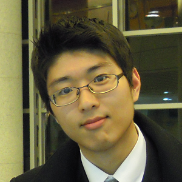

<!--  -->

# Seungjun Nah
{: height="250px" width="250px" .align-right}
<!-- 

    

 -->

<!--  -->

## Ph.D candidate
Department of ECE, SNU, Seoul, Korea  
email: **seungjun.nah@gmail.com**

[Google Scholar](https://scholar.google.co.kr/citations?user=hEr2AKsAAAAJ&hl=en) \
[CV](cv.pdf)

I am a Ph.D student majoring in computer vision at SNU computer vision group, advised by [prof. Kyoung Mu Lee](https://cv.snu.ac.kr/index.php/faculty/).

### Publications (Selected)

* Sanghyun Son, **Seungjun Nah**, and Kyoung Mu Lee, "Clustering Convolutional Kernels to Compress Deep Neural Networks," ECCV 2018 [[github](https://github.com/thstkdgus35/clustering-kernels)]
* Bee Lim, Sanghyun Son, Heewon Kim, **Seungjun Nah**, and Kyoung Mu Lee, "Enhanced Deep Residual Networks for Single Image Super-Resolution," CVPRW 2017 (NTIRE 2017 challenge winners, Workshop best paper) [[github](https://github.com/LimBee/NTIRE2017)]
* **Seungjun Nah**, Tae Hyun Kim, and Kyoung Mu Lee, "Deep Multi-scale Convolutional Neural Network for Dynamic Scene Deblurring," CVPR 2017 (spotlight presentation) [[github](https://github.com/SeungjunNah/DeepDeblur_release)]
* Tae Hyun Kim, **Seungjun Nah**, and Kyoung Mu Lee, "Dynamic Video Deblurring using a Locally Adaptive Linear Blur Model," PAMI

### Research Interests

I am interested in deep learning and low-level computer vision problems, especially visual quality enhancement. 
My recent research topics include deblurring, super-resolution, neural network acceleration.
