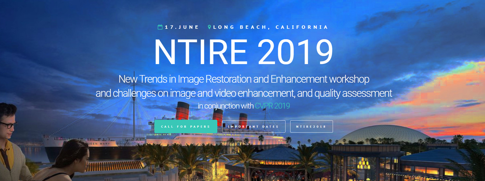

<!--  -->

# Seungjun Nah
{: height="250px" width="250px" .align-right}
<!-- 

    

 -->

<!--  -->

## Ph.D candidate
Department of ECE, SNU, Seoul, Korea  
email: **seungjun.nah@gmail.com**

[Google Scholar](https://scholar.google.co.kr/citations?user=hEr2AKsAAAAJ&hl=en) \
[CV](cv.pdf)

I am a Ph.D student majoring in computer vision at SNU computer vision lab, advised by [prof. Kyoung Mu Lee](https://cv.snu.ac.kr/index.php/faculty/).

### News

* REDS dataset now available! (Project page under construction. Current page is temporary.)

Type | Train | Validation
-- | -- | -- | --
Sharp | [train_sharp](https://drive.google.com/open?id=1YLksKtMhd2mWyVSkvhDaDLWSc1qYNCz-) | [val_sharp](https://drive.google.com/open?id=1MGeObVQ1-Z29f-myDP7-8c3u0_xECKXq)
Blur | [train_blur](https://drive.google.com/open?id=1Be2cgzuuXibcqAuJekDgvHq4MLYkCgR8) | [val_blur](https://drive.google.com/open?id=1N8z2yD0GDWmh6U4d4EADERtcUgDzGrHx)
Blur + Compression | [train_blur_comp](https://drive.google.com/open?id=1hi6348BB9QQFqVx2PY7pKn32HQM89CJ1) | [val_blur_comp](https://drive.google.com/open?id=13d1uzqLdbsQzeZkWgdF5QVHqDSjfE4zZ)
Low Resolution | [train_sharp_bicubic](https://drive.google.com/open?id=1a4PrjqT-hShvY9IyJm3sPF0ZaXyrCozR) | [val_sharp_bicubic](https://drive.google.com/open?id=1sChhtzN9Css10gX7Xsmc2JaC-2Pzco6a)
Blur + Low Resolution | [train_blur_bicubic](https://drive.google.com/open?id=10u8gthv2Q95RMCb1LeCN8N4ozB8TVjMt) | [val_blur_bicubic](https://drive.google.com/open?id=1i3NAb7EmF4fCYadGaHK54-Zgx9lIC2Gp)

* I am co-organizing the [4th NTIRE workshop and challenges](http://www.vision.ee.ethz.ch/ntire19/) in conjunction with CVPR 2019.
Check out our newly released REDS dataset for the video restoration challenges. 
The challenge winners will be awarded at the CVPR 2019 workshop.
Many thanks to my colleagues (Sungyong Baik, Seokil Hong, [Gyeongsik Moon](https://scholar.google.co.kr/citations?user=2f2D258AAAAJ&hl=en), [Sanghyun Son](https://scholar.google.co.kr/citations?user=nWaSdu0AAAAJ&hl=en), [Radu Timofte](https://scholar.google.com/citations?user=u3MwH5kAAAAJ&hl=en) and [Kyoung Mu Lee](https://scholar.google.co.kr/citations?user=Hofj9kAAAAAJ&hl=en)) for collecting, processing and releasing the dataset together.

### Publications (Selected)

* **Seungjun Nah**, Sungyong Baik, Seokil Hong, Gyeongsik Moon, Sanghyun Son, Radu Timofte and Kyoung Mu Lee, "NTIRE 2019 Challenge on Video Deblurring and Super-Resolution: Dataset and Study," CVPRW 2019
* **Seungjun Nah**, Sanghyun Son, and Kyoung Mu Lee, "Recurrent Neural Networks with Intra-Frame Iterations for Video Deblurring," CVPR 2019
* Sanghyun Son, **Seungjun Nah**, and Kyoung Mu Lee, "Clustering Convolutional Kernels to Compress Deep Neural Networks," ECCV 2018 [[github](https://github.com/thstkdgus35/clustering-kernels)]
* Tae Hyun Kim, **Seungjun Nah**, and Kyoung Mu Lee, "Dynamic Video Deblurring using a Locally Adaptive Linear Blur Model," PAMI 2018
* Bee Lim, Sanghyun Son, Heewon Kim, **Seungjun Nah**, and Kyoung Mu Lee, "Enhanced Deep Residual Networks for Single Image Super-Resolution," CVPRW 2017 (NTIRE 2017 challenge winners, Workshop best paper) [[github](https://github.com/LimBee/NTIRE2017)]
* **Seungjun Nah**, Tae Hyun Kim, and Kyoung Mu Lee, "Deep Multi-scale Convolutional Neural Network for Dynamic Scene Deblurring," CVPR 2017 (spotlight presentation) [[github](https://github.com/SeungjunNah/DeepDeblur_release)]

### Research Interests

I am interested in deep learning and low-level computer vision problems, especially visual quality enhancement. 
My recent research topics include deblurring, super-resolution, neural network acceleration.
