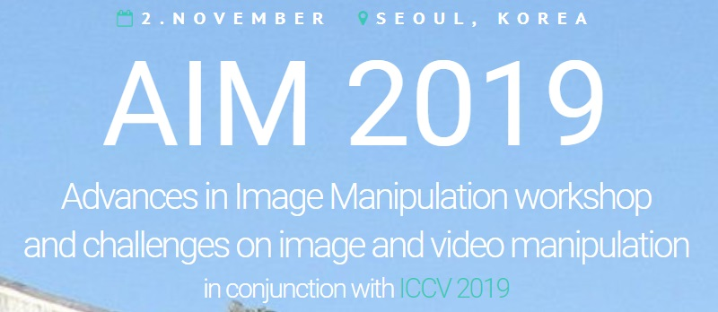
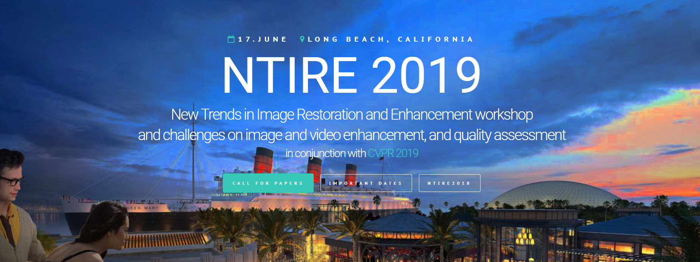

# [Publications](publications) | [Datasets](Datasets/datasets) | [CV](cv.pdf)
---

Ph. D. candidate  
Department of ECE, SNU, Seoul, Korea  
email: **seungjun.nah@gmail.com**  
Google scholar: **[profile](https://scholar.google.com/citations?user=hEr2AKsAAAAJ&hl=en)**  

I am a Ph.D student majoring in computer vision at SNU computer vision lab, advised by [prof. Kyoung Mu Lee](https://cv.snu.ac.kr/index.php/faculty/).

## Research Interests

I am interested in deep learning and low-level computer vision problems, especially visual quality enhancement. 
My recent research topics include deblurring, super-resolution, neural network acceleration.

## Community activities

* **Conference reviewer**: CVPR, ICCV, SIGGRAPH Asia  
* **Journal reviewer**: IJCV, TIP, TMM, TNNLS  
* **Workshop co-organizer**: NTIRE 2019, AIM 2019  

## Awards and Honors

* **Best reviewer**: ICCV 2019  
* **Highly cited paper award 2018**: Department of ECE, SNU  
* **Challenge winner & best paper**: NTIRE 2017 Challenge on Single Image Super-Resolution

## News

* I'm co-organizing the **[1st Advances in Image Manipulation workshop and challenges](http://www.vision.ee.ethz.ch/en/aim19/)** in conjunction with ICCV 2019. I and [Sanghyun Son](https://scholar.google.com/citations?user=nWaSdu0AAAAJ&hl=en) are in charge of [Video Temporal Super-Resolution Challenge](https://competitions.codalab.org/competitions/20244).  
* **[REDS](Datasets/reds)** dataset for video deblurring/super-resolution is available!  
* I co-organized the **[4th NTIRE workshop and challenges](http://www.vision.ee.ethz.ch/ntire19/)** in conjunction with CVPR 2019. Many thanks to my colleagues, [Sungyong Baik](https://scholar.google.com/citations?user=lQ4gotkAAAAJ&hl=en), Seokil Hong, [Gyeongsik Moon](https://scholar.google.com/citations?user=2f2D258AAAAJ&hl=en), [Sanghyun Son](https://scholar.google.com/citations?user=nWaSdu0AAAAJ&hl=en), [Radu Timofte](https://scholar.google.com/citations?user=u3MwH5kAAAAJ&hl=en) and [Kyoung Mu Lee](https://scholar.google.com/citations?user=Hofj9kAAAAAJ&hl=en) for collecting, processing and releasing the **[REDS](Datasets/reds)** dataset together.  
<!-- 
 -->